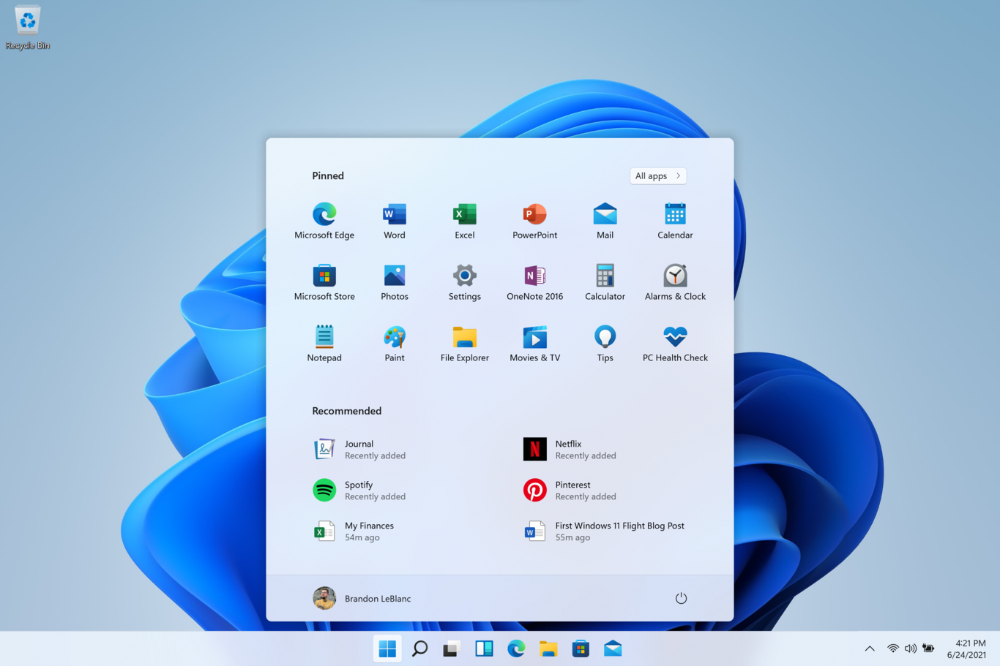
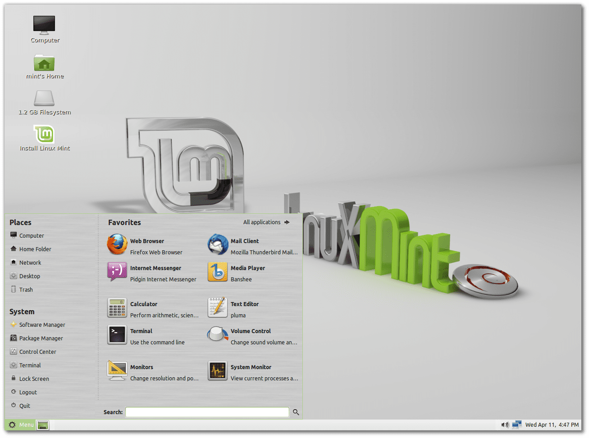
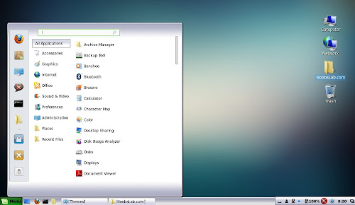
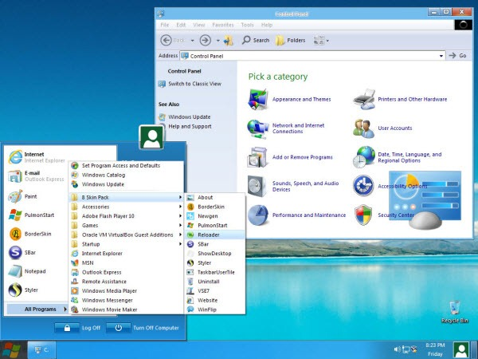

## Why Windows 11 UI Sucks

In this article, I will tell you why the UI of Windows 11 sucks and why I will stick with Windows 10 for a while.

### The Promise of a New Interface
With the release of Windows 11 many users were eager to experience the refreshed UI and its promised improvements. However, upon installation and initial usage I feel disappointed and even frustrated by the interface.

One of the immediate observations is the apparent resemblance to older interfaces, such as Linux Mint from a decade ago or custom themes for Windows XP created by individuals. 

## Similitudes with old interfaces

At a glace Windows 11 seems a copy to an olders user interfaces, like cinnamon (linux mint) and windows xp themes (is a shame)

### Windows 11

### Linux mint Maya 2013 (cinnamon)

### Windows XP Theme(s)

## Conclusion
In a rapidly evolving digital landscape, where design trends and user expectations continuously evolve, Windows 11 interface appears to be arriving late to the party, they sent to trash his metro UI and bet for a brand new interface, but they lost what they had.

